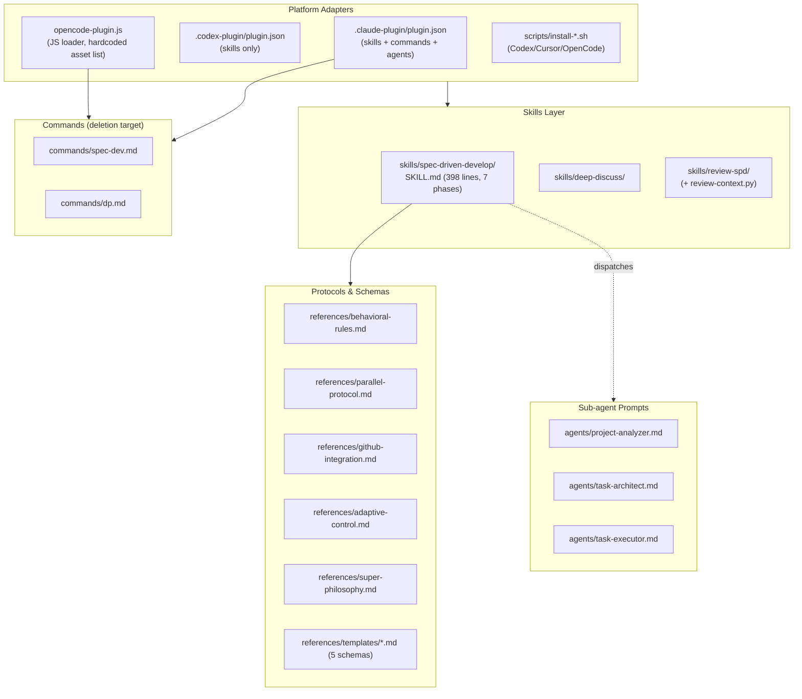

# Project Overview

## Preliminary Direction

Transform the SDD plugin's execution model: the main agent becomes a pure orchestrator (decompose tasks → dispatch parallel coder sub-agents → route output through independent reviewer sub-agents for review-and-fix → own progress + quality via acceptance criteria). In parallel: slim all prompts to rules + methodology (remove verbose examples and duplicated restatements), and delete the `commands/` surface keeping only skills.

## Current Architecture

Layered Markdown instruction system. One self-contained plugin directory (`plugins/spec-driven-develop/`) is the single artifact; four platform adapters deliver the same Markdown.

**Execution model today**: the main agent already orchestrates analysis (parallel `project-analyzer`s), planning (`task-architect`s), and execution (one `task-executor` per lane in worktrees, orchestrator = single writer for drift/MASTER/PR). What does **not** exist: an independent reviewer sub-agent inside the SDD loop. Post-task QC is the orchestrator self-applying checklists. The only reviewer contract lives in the separate, user-invoked `review-spd` skill (`references/reviewer-template.md`) — a ready-made contract to reuse.

## Technology Stack

| Layer | Current | Target |
|:------|:--------|:-------|
| Workflow defs | Markdown + YAML frontmatter (3 skills, ~1,900 lines) | Same, slimmed/de-duplicated |
| Sub-agent prompts | Markdown + Claude frontmatter (3 agents, 403 lines) | 4 agents (add reviewer), slimmed |
| Slash commands | 2 thin launchers (28 lines) | **Deleted** |
| Manifests | 4 JSON files, version pinned in 4 places | Same layout, commands removed |
| Runtime | `opencode-plugin.js` (95 lines, Node ESM); Python 3 stdlib (2 scripts); Bash (4 installers) | Same; loader no longer reads commands/ |
| External deps | None required; `gh` CLI optional (GitHub modes) | Unchanged |
| CI / tests | None; static checks only (py_compile, bash -n, rg, git diff --check) | Add cross-reference/version consistency check |

## Entry Points

- **Claude Code**: marketplace install → skills auto-trigger; `/spec-dev`, `/dp` manual commands; 3 registered sub-agents.
- **Codex**: marketplace/config.toml or `install-codex.sh` → `~/.codex/skills/`.
- **OpenCode**: `install-opencode.sh` or `opencode.json` → JS loader registers skills path + 2 commands + 3 agents at startup (hardcoded asset list — breaks on any rename/delete).
- **Cursor**: `install-cursor.sh` → `~/.cursor/skills/`.
- **ZCode/user-local**: `~/.agents/skills/` holds a synced 1.14.0 copy via an **undocumented sync path** (no repo script targets it).
- **Generic**: copy `SKILL.md` + `references/`.

## Build & Run

No build. Validation per `AGENTS.md`:
- `python -m py_compile scripts/export-progress.py` (note: does not cover the two `review-context.py` copies)
- `bash -n scripts/install-codex.sh scripts/install-cursor.sh scripts/install-opencode.sh scripts/install-all.sh`
- Targeted `rg` checks for workflow language; `git diff --check`

Release = bump 4 version strings (SKILL.md frontmatter L13, `.claude-plugin/plugin.json`, `.codex-plugin/plugin.json`, `.claude-plugin/marketplace.json`) + update both READMEs. No CHANGELOG, no tags.

## Testing Baseline

No automated test suite, no CI (`.github/` = PR template only). The de-facto test surface is AGENTS.md's static checks. **Coverage gaps**: no Markdown cross-reference existence check, no manifest↔filesystem consistency check, no version-parity check, no frontmatter lint, no check that `export-progress.py` regexes still match `templates/progress.md`. PR template enforces a "problem-driven change" evidence bar in lieu of tests.

## Project Governance Baseline

- **Canonical shared surface**: `AGENTS.md` (32 lines) — truth sources, Markdown-first rule, joint-update rule (SKILL.md + references/templates + agent prompts together), validation commands. `CLAUDE.md` (11 lines) defers to it; L8 references `commands/` (goes stale on deletion).
- **Absent**: `.cursor/rules/`, `.windsurf/`, `.clinerules*`, `.codex/`; no repo-local memory file (AGENTS.md explicitly forbids inventing one). Native-memory-only policy.
- **Governance gap**: AGENTS.md Truth Sources omits `commands/`, `opencode-plugin.js`, and marketplace manifests; Validation omits 2 of 3 Python files.

## External Integrations

- GitHub (`gh` CLI) for GITHUB_FULL/GITHUB_STANDARD tracking modes; repo upstream `github.com/zhu1090093659/spec_driven_develop`, local `main` = `798d21d` = remote.
- Plugin distribution: Claude marketplace, Codex marketplace, OpenCode config, curl-able installers; ZCode plugin cache at `~/.zcode/cli/plugins/cache/` (holds stale 1.13.1 copy).
