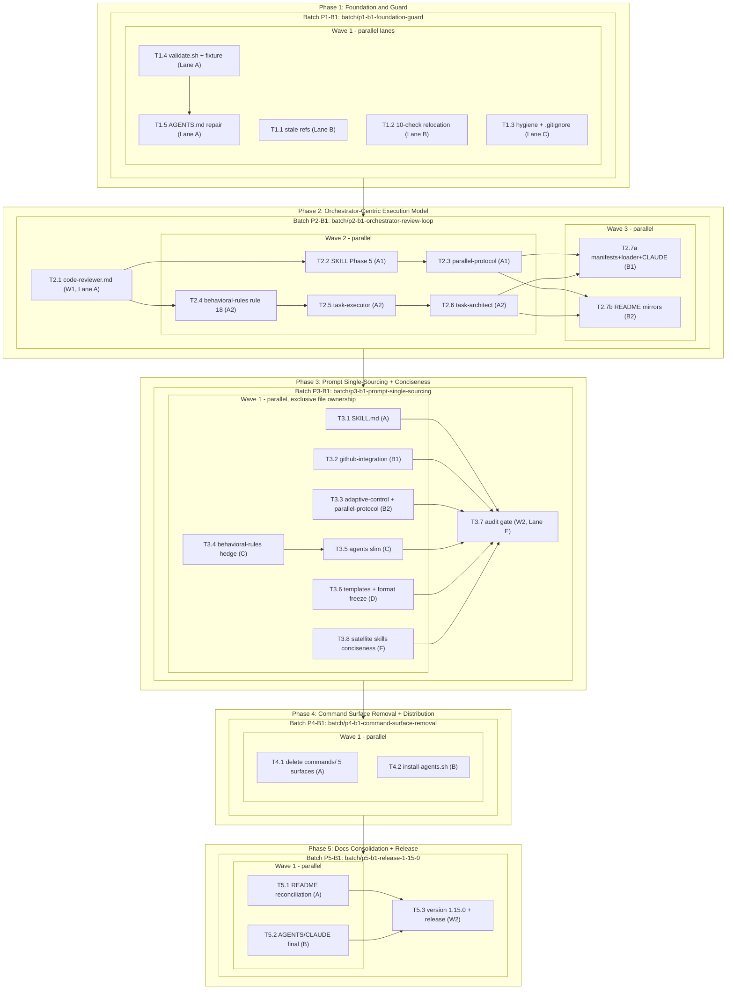

# Task Dependency Graph

**Critical path**: T1.4 → T2.1 → T2.2 → T2.3/T2.6 → T2.7 → T3.1 → T3.7 → T4.1 → T5.1 → T5.3.

Phase gates P1→P2→P3→P4→P5 are hard (sequential batches). Within phases, lanes with exclusive file ownership run in parallel waves. The P2 chain is the longest single-phase segment because writer-model prose must land coherently before registration.
