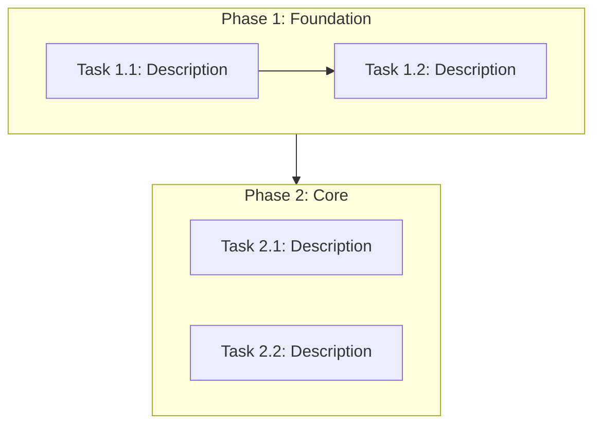

# Document Templates Reference

This file contains the standard templates for all documents generated by the Spec-Driven Develop workflow. When creating documents in `docs/`, use these templates as the starting point and adapt the content to the specific project.

---

## Directory Structure

### Standard / Full Mode

```
docs/
├── analysis/
│   ├── project-overview.md
│   ├── module-inventory.md
│   └── risk-assessment.md
├── plan/
│   ├── task-breakdown.md
│   ├── dependency-graph.md
│   └── milestones.md
└── progress/
    ├── MASTER.md
    ├── phase-1-<short-name>.md
    ├── phase-2-<short-name>.md
    └── ...
```

### Lite Mode

```
docs/
├── analysis/
│   └── quick-summary.md
├── plan/
│   └── task-list.md
└── progress/
    └── MASTER.md          (contains embedded task checklist)
```

---

## Analysis Templates

### project-overview.md

```markdown
# Project Overview

## Task Definition
<!-- One-sentence summary of what this transformation aims to achieve -->

## Current Architecture
<!-- High-level architecture diagram (Mermaid) and description -->

## Technology Stack
| Layer        | Current          | Target           |
|:-------------|:-----------------|:-----------------|
| Language     |                  |                  |
| Framework    |                  |                  |
| Build Tool   |                  |                  |
| Package Mgr  |                  |                  |
| Database     |                  |                  |
| Deployment   |                  |                  |

<!-- Remove rows that don't apply to this project -->

## Entry Points
<!-- List of main entry points: CLI commands, API endpoints, UI routes, etc. -->

## Build & Run
<!-- How to build, test, and run the project currently -->

## External Integrations
<!-- APIs, databases, services, file systems the project interacts with -->
```

### module-inventory.md

```markdown
# Module Inventory

| Module | Responsibility | Dependencies | Files | Lines | Complexity | Risk Flag |
|:-------|:---------------|:-------------|------:|------:|:-----------|:----------|
|        |                |              |       |       |            |           |

<!-- Risk Flag: leave blank for normal, [NEEDS-DEEP-DIVE] for modules requiring further analysis -->

## Module Details

### <Module Name>
- **Path**: `src/module_name/`
- **Responsibility**: What this module does
- **Public API**: Key functions/classes exposed to other modules
- **Internal Dependencies**: Which other project modules it imports
- **External Dependencies**: Third-party libraries it uses
- **Complexity Rating**: Low / Medium / High / Critical
- **Transformation Notes**: Specific challenges or considerations for this module
```

### risk-assessment.md

```markdown
# Risk Assessment

## Risk Matrix

| ID  | Risk | Impact | Likelihood | Severity | Mitigation |
|:----|:-----|:-------|:-----------|:---------|:-----------|
| R1  |      |        |            |          |            |
| R2  |      |        |            |          |            |

<!-- Use risk IDs (R1, R2...) so tasks can reference them in task-breakdown.md -->

## High-Severity Risks
<!-- Detailed discussion of each high-severity risk -->

## Technical Debt
<!-- Pre-existing issues that may complicate the transformation -->

## Compatibility Concerns
<!-- API compatibility, data format changes, deployment changes -->
```

### quick-summary.md (Lite Mode only)

```markdown
# Quick Summary

## Tech Stack
<!-- Language, framework, build tool — one line each -->

## Key Files in Scope
<!-- List of the most important files that will be modified -->

## Top 3 Risks
1. ...
2. ...
3. ...
```

---

## Plan Templates

### task-breakdown.md

```markdown
# Task Breakdown

## Overview
- **Total Phases**: N
- **Total Tasks**: N
- **Estimated Total Effort**: S/M/L/XL

## Phase 1: <Phase Name>
**Goal**: What this phase achieves
**Prerequisite**: What must be done before this phase

| # | Task | Priority | Effort | Depends On | Risk | Acceptance Criteria |
|:--|:-----|:---------|:-------|:-----------|:-----|:--------------------|
| 1 |      | P0       | M      | —          | R1   |                     |
| 2 |      | P1       | S      | 1          | —    |                     |

<!-- Risk column references risk IDs from risk-assessment.md -->
<!-- Within the same priority level, tasks are ordered by risk severity (highest first) -->

## Phase 2: <Phase Name>
<!-- Same structure as Phase 1 -->
```

### task-list.md (Lite Mode only)

```markdown
# Task List

| # | Task | Effort | Acceptance Criteria |
|:--|:-----|:-------|:--------------------|
| 1 |      | S      |                     |
| 2 |      | M      |                     |
| 3 |      | S      |                     |
```

### dependency-graph.md

````markdown
# Task Dependency Graph



## Critical Path
<!-- The sequence of tasks that determines the minimum total duration -->
````

### milestones.md

```markdown
# Milestones

| # | Milestone | Target Phase | Criteria | Status |
|:--|:----------|:-------------|:---------|:-------|
| 1 |           | After Phase 1|          | ⏳     |
| 2 |           | After Phase 3|          | ⏳     |

Status legend: ⏳ Pending, 🔄 In Progress, ✅ Achieved
```

---

## Progress Templates

### MASTER.md — Standard / Full Mode

```markdown
# [Task Name] — Progress Tracker

> **Task**: One-line description
> **Mode**: Standard / Full
> **Started**: YYYY-MM-DD
> **Last Updated**: YYYY-MM-DD

## References
- [Project Overview](../analysis/project-overview.md)
- [Module Inventory](../analysis/module-inventory.md)
- [Risk Assessment](../analysis/risk-assessment.md)
- [Task Breakdown](../plan/task-breakdown.md)
- [Dependency Graph](../plan/dependency-graph.md)
- [Milestones](../plan/milestones.md)

## Phase Summary

| Phase | Name | Tasks | Done | Progress |
|:------|:-----|------:|-----:|:---------|
| 1     |      |     N |    0 | ⬜⬜⬜⬜⬜ |
| 2     |      |     N |    0 | ⬜⬜⬜⬜⬜ |

## Phase Checklist
- [ ] Phase 1: <n> (0/N tasks) — [details](./phase-1-<n>.md)
- [ ] Phase 2: <n> (0/N tasks) — [details](./phase-2-<n>.md)

## Current Status
<!-- Updated by the agent at the start and end of each work session -->
**Active Phase**: Phase N
**Active Task**: Task description
**Next Action**: [Exact operation the agent should perform next when resuming]
**Blockers**: None / description

## Next Steps
<!-- What the agent should do next when resuming in a new conversation -->
1. ...
2. ...

## Timeline
<!-- Append-only log of task completions with timestamps -->
- YYYY-MM-DD HH:MM — [Phase X Task Y.Z] completed: brief description

## Decisions
<!-- Link to major decisions recorded in phase files, or record cross-phase decisions here -->
<!-- Use ADR-lite format:
**Decision**: [What was decided]
**Context**: [Why, what alternatives existed]
**Consequence**: [Impact on subsequent work]
-->

## Session Log
<!-- Append-only log of work sessions -->
| Date | Session | Summary |
|:-----|:--------|:--------|
|      |         |         |
```

### MASTER.md — Lite Mode

```markdown
# [Task Name] — Progress Tracker (Lite)

> **Task**: One-line description
> **Mode**: Lite
> **Started**: YYYY-MM-DD
> **Last Updated**: YYYY-MM-DD

## References
- [Quick Summary](../analysis/quick-summary.md)
- [Task List](../plan/task-list.md)

## Tasks
- [ ] Task 1: description
  - Acceptance: criteria
- [ ] Task 2: description
  - Acceptance: criteria

## Current Status
**Active Task**: Task description
**Next Action**: [Exact operation to perform next]
**Blockers**: None / description

## Timeline
- YYYY-MM-DD HH:MM — Task N completed: brief description
```

### phase-N-\<name\>.md (Per-Phase Detail File)

```markdown
# Phase N: <Phase Name>

**Goal**: What this phase achieves
**Status**: Not Started / In Progress / Complete

## Tasks
- [ ] **Task N.1**: Description
  - Risk: R1 / —
  - Acceptance: How to verify this is done
  - Notes: _none yet_
- [ ] **Task N.2**: Description
  - Risk: — 
  - Acceptance: How to verify this is done
  - Notes: _none yet_

## Decisions
<!-- Record significant choices made during this phase using ADR-lite format -->
<!--
**Decision**: [What was decided]
**Context**: [Why this decision was needed, what alternatives existed]
**Consequence**: [What this means for subsequent work]
-->

## Phase Notes
<!-- Blockers, context discovered during this phase -->

## Phase Completion Checklist
- [ ] All tasks above are checked off
- [ ] MASTER.md phase count updated
- [ ] MASTER.md "Current Status" updated to next phase
- [ ] MASTER.md "Timeline" entries added for all completed tasks
```

---

## Sub-SKILL Templates

When generating a task-specific sub-SKILL in Phase 4, first check `references/sub-skill-templates/` for a matching template. If a template exists, use it as a base and customize. If not, delegate to the platform's native skill-creator or create from scratch.

Provide the following information:

- **Name**: `<task-type>-dev` (e.g., `rust-migration-dev`, `microservice-overhaul-dev`)
- **Description**: Should reference the specific task and include trigger keywords
- **Content outline**:
  1. Cross-conversation continuity protocol (read MASTER.md first, run Session Handshake)
  2. Target technology coding standards and conventions
  3. Progress update instructions (how to update checkboxes, MASTER.md counts, Timeline, and Next Action)
  4. Decision recording instructions (ADR-lite format in phase file's Decisions section)
  5. Phase-specific development guidance
  6. Cleanup trigger (when all tasks done, initiate cleanup)
